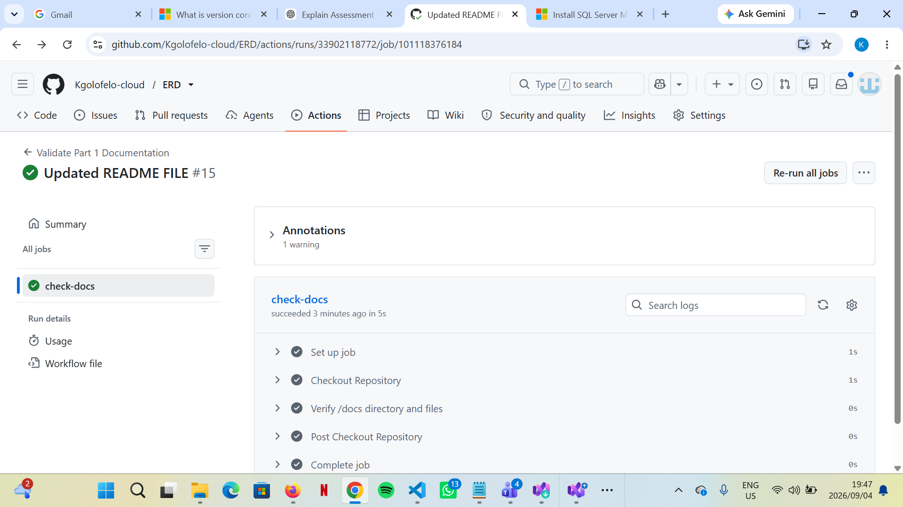

# RaceDay Event Management System
 
## System Description

RaceDay is a centralized, digital event management platform designed specifically for the South African road running, walking, and cycling community. Historically, many local events have relied on disconnected, paper-based registration systems. RaceDay solves this by providing a comprehensive database and API architecture to handle event creation, geographic locations, race categories, participant enrolments, and final race results in a single, scalable system.
 
## User Roles

The system enforces role-based access control with two primary roles:

*   **Organiser:** Has administrative privileges to create new events, define event locations, set up race categories (e.g., 21km, 10km), and officially capture participant race results.

*   **Participant:** Can create a personal account, browse available upcoming events, enrol in specific race categories, and track their personal race completion history and times.
 
## Setup Instructions

This repository contains the Part 1 planning documentation and database schema.
 
1. **Database Setup:** 

   * Open SQL Server Management Studio (SSMS).

   * Open the `/docs/Raceday_Database.sql` file.

   * Execute the script on a fresh SQL Server instance. It will automatically create the `RaceDay_Database` database, provision the tables, and insert realistic seed data.

2. **Review Planning Documents:**

   * The Entity Relationship Diagram (ERD) can be viewed at `/docs/Raceday_ERD.pdf`.

   * The RESTful API endpoint plan is available in `/docs/API records.pdf`.
 
## CI/CD Pipeline Status

*(Note to student: Save your green checkmark screenshot as 'cicd-success.png' in the /docs folder so it displays here)*
 
## Video Presentation

[Insert Unlisted YouTube Video Link Here]
 
